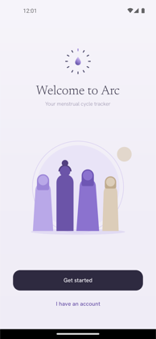
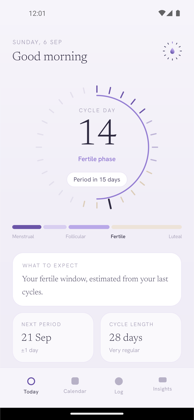
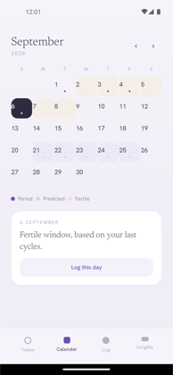
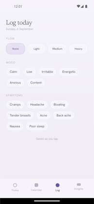
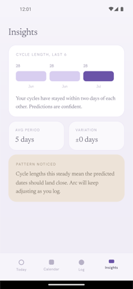
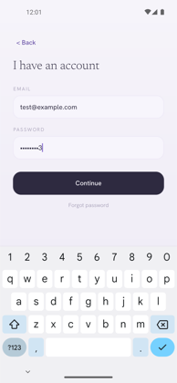

<div align="center">
  
  <h1>Arc</h1>
  <p><strong>Your menstrual cycle tracker</strong></p>
</div>

Arc is an Android app for tracking a menstrual cycle. You log the days you bleed
and how you feel; Arc works out your cycle length, tells you where you are in the
current cycle, and predicts when the next period, fertile window and ovulation
are due.

It began as a university assignment (a static screen mock-up of the Clue app) and
has since been rebuilt into a working application: a real data layer, real cycle
maths, and a designed interface.

---

## Screenshots

| Start | Today | Calendar |
|:--:|:--:|:--:|
|  |  |  |
| Welcome and sign-in | The cycle ring, phase timeline and predictions | Logged, predicted and fertile days |

| Log | Insights | Sign in |
|:--:|:--:|:--:|
|  |  |  |
| Flow, mood and symptoms for one day | Cycle history and averages | Email and password |

---

## Features

### The cycle ring

The Today screen is built around a ring of tick marks — **one tick per day of your
cycle**, so the shape alone tells you how far along you are before you read a word.

- Deep purple ticks are bleeding days
- Sand ticks are the fertile window
- The tall dark tick is today
- The thin arc sweeps from the top to show progress through the cycle

Underneath, a **phase timeline** shows the menstrual, follicular, fertile and luteal
phases in proportion, with the phase you are currently in picked out.

### Period logging

Mark any day as a bleeding day and set the flow — **none, light, medium or heavy**.
Days are stored individually, so you can correct a mistake on any date and
everything recalculates.

### Predictions

Arc predicts, from your own history:

- the **date your next period starts**, and how many days away it is
- your **fertile window**
- your **estimated ovulation day**
- whether your period is **late**, and by how much

### Calendar

A month grid showing logged period days, predicted period days, the fertile window,
and a dot on any day with something logged. Tap a day to read what Arc knows about
it, and jump straight to logging it.

### Daily logging

For any date, record:

- **Flow** — none / light / medium / heavy
- **Mood** — calm, low, irritable, energetic, anxious, content
- **Symptoms** — cramps, headache, bloating, tender breasts, acne, back ache,
  nausea, poor sleep

Every tap saves immediately; there is no save button to forget.

### Insights

- A bar chart of your **last six cycle lengths**
- **Average cycle length** and **average period length**
- **Variation** — how much your cycles differ from each other
- A plain-language read on whether your cycles are steady enough for the
  predictions to be trusted

---

## How the predictions work

Worth understanding, because it explains both the strengths and the limits.

Arc stores **one row per bleeding day** rather than storing "cycles". Cycles are
*derived* by grouping calendar-consecutive days into periods:

1. **Cycle start** — the first day of each run of consecutive bleeding days.
2. **Cycle length** — the gap between one cycle start and the next.
3. **Period length** — how many days that run of bleeding lasted.
4. **Average cycle length** — the mean of all *completed* cycles.
5. **Next period** = last cycle start + average cycle length.
6. **Ovulation** = next period − 14 days (the luteal phase is the stable part of
   the cycle, so counting back from the next period is more reliable than counting
   forward from the last one).
7. **Fertile window** = 5 days before ovulation through 1 day after.

Until you have logged two full cycles, Arc falls back to a **28-day cycle and a
5-day period** and labels the prediction as an estimate.

Because cycles are derived rather than stored, editing a day can never leave the
history inconsistent — it just gets recomputed.

The maths lives in
[`CycleCalculator.java`](src/main/java/com/example/arc/cycle/CycleCalculator.java)
as pure functions over plain data, with no Android or database types, so it can be
read and reasoned about on its own.

---

## Tech

| | |
|---|---|
| Language | Java 8 (with core library desugaring) |
| Min / target / compile SDK | 21 / 31 / 33 |
| Build | Gradle 7.6.4, Android Gradle Plugin 7.4.2, JDK 17 |
| Database | Room 2.4.3 |
| UI | Android views + fragments, Material Components |
| Fonts | Newsreader (serif) and Hanken Grotesk (sans), bundled |

There is **no third-party UI library**. Two custom views do the work the framework
doesn't provide:

- [`CycleRingView`](src/main/java/com/example/arc/ui/widget/CycleRingView.java) —
  draws the tick ring and progress arc
- [`FlowLayout`](src/main/java/com/example/arc/ui/widget/FlowLayout.java) —
  wraps chips onto multiple lines

`java.time.LocalDate` is used throughout for dates; core library desugaring makes
that work down to API 21.

### Project structure

> **Note:** the repository root *is* the app module. There is no `app/`
> subdirectory — `build.gradle` at the root is the module's build file.

```
├── build.gradle              # app module build script
├── settings.gradle           # Gradle project definition
├── run.sh                    # build + install + launch helper
├── docs/screenshots/
└── src/main/
    ├── AndroidManifest.xml
    ├── java/com/example/arc/
    │   ├── cycle/            # cycle maths — no Android dependencies
    │   │   ├── CycleCalculator.java
    │   │   ├── CycleInsights.java
    │   │   ├── Cycle.java, DayKind.java, Phase.java
    │   ├── data/             # Room entities, DAOs, repository
    │   │   ├── ArcDatabase.java
    │   │   ├── CycleRepository.java
    │   │   ├── PeriodDay.java, SymptomEntry.java
    │   │   └── LogOptions.java
    │   ├── ui/               # screens
    │   │   ├── MainActivity.java        # tab shell
    │   │   ├── TodayFragment.java
    │   │   ├── CalendarFragment.java
    │   │   ├── LogFragment.java
    │   │   ├── InsightsFragment.java
    │   │   ├── StartActivity.java, LoginActivity.java, RegisterActivity.java
    │   │   └── widget/       # CycleRingView, FlowLayout, ChipGroupBuilder
    │   └── util/Validation.java
    └── res/                  # layouts, drawables, fonts, colours, strings
```

---

## Running it on your machine

### Requirements

- **JDK 17** — the build will not run on Java 21+ or on Java 11
- **Android SDK** with platform 33, build-tools 33.0.2 and platform-tools
- An **emulator** or a physical Android device (Android 5.0 / API 21 or newer)

You do **not** need to install Gradle — the wrapper handles it.

### 1. Clone

```bash
git clone <your-repo-url> arc && cd arc
```

### 2. Install a JDK 17

macOS (Homebrew):

```bash
brew install openjdk@17
```

Debian / Ubuntu:

```bash
sudo apt install openjdk-17-jdk
```

Windows: install [Temurin 17](https://adoptium.net/temurin/releases/?version=17).

### 3. Install the Android SDK

**Easiest — Android Studio.** Install it, open this folder, and let it download the
SDK for you. Skip to step 5.

**Command line only.** Install the command-line tools, then:

```bash
sdkmanager "platform-tools" "platforms;android-33" "build-tools;33.0.2" "emulator" "system-images;android-33;google_apis;arm64-v8a"
```

Use `x86_64` instead of `arm64-v8a` on an Intel or AMD machine.

> The emulator system image is large — budget around **10 GB** for the SDK with an
> emulator, or about **1.5 GB** if you only build and deploy to a physical phone.

> **If `avdmanager` later says "Package path is not valid"**, it is looking in the
> wrong place. `avdmanager` infers the SDK root from where it is installed, so if
> your command-line tools live outside the SDK directory (Homebrew installs them
> that way), copy them in:
>
> ```bash
> mkdir -p "$ANDROID_HOME/cmdline-tools"
> cp -R /opt/homebrew/share/android-commandlinetools/cmdline-tools/latest "$ANDROID_HOME/cmdline-tools/"
> ```
>
> then run `avdmanager` from `$ANDROID_HOME/cmdline-tools/latest/bin/`. A symlink
> is not enough — the path is resolved through symlinks.

### 4. Point the build at your SDK

`local.properties` is deliberately not committed, so create it:

```bash
echo "sdk.dir=$HOME/Library/Android/sdk" > local.properties
```

On Linux the path is usually `$HOME/Android/Sdk`; on Windows,
`C:\\Users\\<you>\\AppData\\Local\\Android\\Sdk`. Android Studio writes this file
for you automatically.

### 5. Create an emulator (skip if using a physical device)

```bash
avdmanager create avd -n arc -k "system-images;android-33;google_apis;arm64-v8a" -d pixel_5
```

### 6. Build and run

Boot an emulator in one terminal:

```bash
./run.sh emulator
```

Then, in another:

```bash
./run.sh
```

`run.sh` builds the APK, installs it and launches the app. It finds your JDK and
SDK automatically if `JAVA_HOME` / `ANDROID_HOME` are not already set.

**On a physical device**, enable USB debugging, plug it in, and run `./run.sh` on
its own — no emulator needed.

**In Android Studio**, just press Run.

### Building without the helper script

```bash
./gradlew assembleDebug
```

The APK lands at `build/outputs/apk/debug/Arc-debug.apk`.

> Always use `./gradlew`, not a system-wide `gradle`. This project pins Gradle
> 7.6.4; a newer Gradle will fail because Android Gradle Plugin 7.4.2 does not
> support it.

### Useful commands

| Command | What it does |
|---|---|
| `./gradlew assembleDebug` | Build the debug APK |
| `./gradlew clean` | Delete build output |
| `./run.sh` | Build, install and launch |
| `./run.sh emulator` | Boot an emulator |
| `adb logcat -s Arc:D` | Watch the app's own log output |
| `adb devices` | List connected devices and emulators |

### Troubleshooting

| Problem | Fix |
|---|---|
| `Unsupported class file major version` | You are on the wrong JDK. Use 17. |
| `SDK location not found` | Create `local.properties` — step 4. |
| `No AVD found` | Create an emulator — step 5, or plug in a phone. |
| `adb: no devices/emulators found` | The emulator has not finished booting, or USB debugging is off. |
| Gradle fails on an unsupported plugin version | You are using a system `gradle`. Use `./gradlew`. |

---

## Known limitations

Stated plainly, so nobody is surprised:

- **There is no real authentication.** The sign-up and sign-in screens validate the
  format of what you type, but no account is created and no credentials are
  checked or stored. Any well-formed email and password gets you in.
- **Predictions are a simple average.** Arc reports one predicted date rather than a
  range, and accuracy degrades if your cycles are irregular. It is not a
  contraceptive tool.
- **Data lives only on the device.** There is no account, sync or backup, and
  uninstalling the app deletes everything.
- **Database migrations are destructive.** Schema changes drop existing data — fine
  before release, but it needs real migrations before anyone relies on it.
- **There are no automated tests.** `CycleCalculator` is written as pure functions
  specifically so it can be unit tested; that has not been done yet.

Arc is a learning project. It is not a medical device and gives no medical advice.
